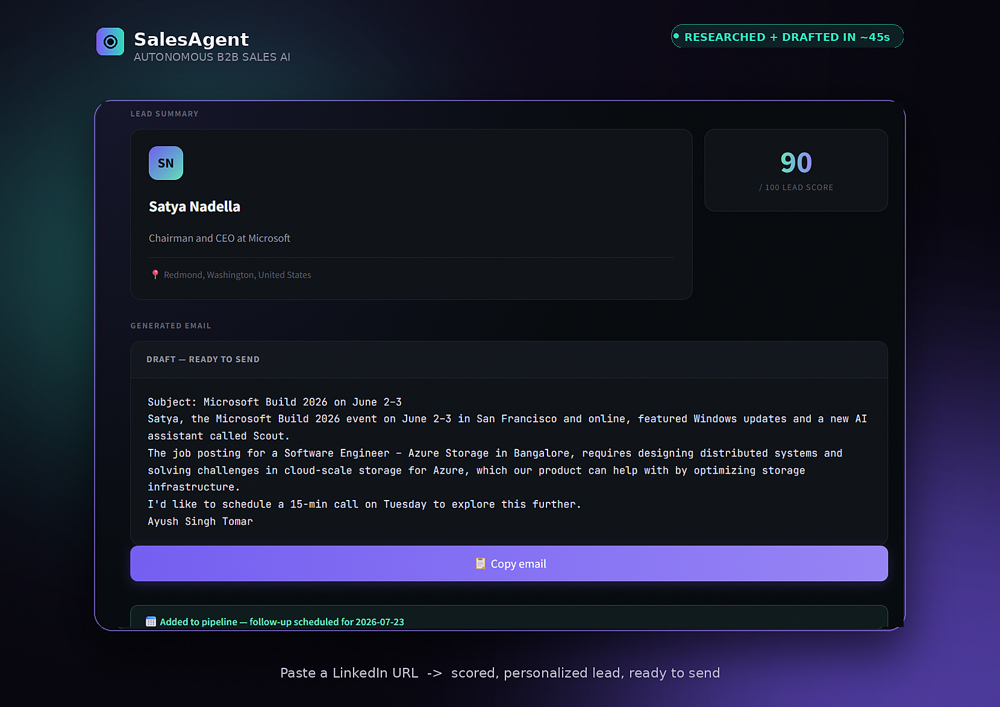

# SalesAgent — Autonomous B2B Sales AI

> An AI agent that researches a lead, scores them, and writes a personalized cold email — in 45 seconds, from just a LinkedIn URL.

[🔗 Live Demo](https://salesagent-theta.vercel.app) &nbsp;|&nbsp; [⚙️ API Docs](https://salesagent-ufu7.onrender.com/docs) &nbsp;|&nbsp; [📝 Technical Writeup](https://dev.to/ayushsinghtomar/i-got-tired-of-writing-cold-emails-so-i-built-an-ai-agent-to-do-it-for-me-2m4h) &nbsp;|&nbsp; [👤 LinkedIn](https://www.linkedin.com/in/ayush-s-tomar/)

<p align="center">
  
</p>

<p align="center">
  <em>One URL in. A scored, personalized lead out — in ~45 seconds.</em>
</p>

### 🎥 Demo Video

<!-- Option A: GitHub-hosted (best for README rendering) -->
<!-- Upload docs/demo.mp4 via a GitHub Issue/PR comment to get a CDN link, then swap it in below: -->
https://github.com/user-attachments/assets/REPLACE-WITH-YOUR-ASSET-ID

<!-- Option B: YouTube thumbnail link (use this instead if your video is on YouTube) -->
<!--
[](https://youtu.be/YOUR-VIDEO-ID)
-->

---

## The Problem

Manual B2B lead research takes 1–2 hours per lead: checking LinkedIn, Googling company news, reading job postings to infer pain points, then writing a personalized email from scratch.

**SalesAgent compresses this to 45 seconds** — not a CRM with AI bolted on, but an AI agent that *is* the workflow.

---

## What It Does

Paste a LinkedIn URL. The LangGraph agent autonomously runs a 5-step pipeline:

| Step | What happens |
|------|-------------|
| 🔍 **Research** | Calls tools to search company news, analyze job postings for pain points, find tech stack |
| 📊 **Score** | Random Forest ML model scores the lead 0–100 based on profile & company signals |
| ✍️ **Draft** | Writes a hyper-personalized cold email referencing real company events & hiring signals |
| 💾 **Save** | Adds enriched lead + deal to CRM pipeline with auto-scheduled follow-up |
| 🧠 **Remember** | Stores full interaction history for future agent recall |

```
LinkedIn URL → [Research] → [Score] → [Draft Email] → [Pipeline]
                   ↑                                        |
                   └──────── Long-term memory (SQLite) ─────┘
```

---

## Demo Output

**Input:** `https://www.linkedin.com/in/satya-nadella`

**Agent trace (live, ~45 seconds):**
```
🔍 Researching lead from LinkedIn...           ✅ DONE
📊 Scoring lead with ML model...               ✅ DONE  →  84/100
✍️ Drafting personalized cold email...         ✅ DONE
💾 Saving to CRM pipeline...                   ✅ DONE  →  Follow-up: 2026-06-26
```

**Generated email (real output):**
```
Subject: on The Road to Quantum Advancements

Satya,

I was excited to see Microsoft's showcase of native OpenClaw app for Windows,
Unmetered Agentic AI models, and the preview of the Microsoft quantum computer
at Build 2026. Your emphasis on agent-first architecture aligns with my own
research on how this shift in paradigm will drive the next wave of innovation...
```

The agent found **real, live company data** — Microsoft Build 2026 announcements,
quantum computing preview, hiring signals — and synthesized it into a targeted email.
No templates. No placeholders.

---

## Tech Stack

| Layer | Technology |
|-------|-----------|
| Agent framework | LangGraph (StateGraph + tool-calling loop) |
| LLM | Groq API (`llama-3.1-8b-instant`) |
| Web intelligence | Tavily Search API |
| LinkedIn enrichment | Proxycurl API (optional — fallback works without it) |
| ML lead scoring | scikit-learn (Random Forest) |
| Backend | FastAPI + SQLite |
| Frontend | React + Tailwind |
| Backend deploy | Render |
| Frontend deploy | Vercel |

---

## What Makes This Agentic

**Real tool-calling** — The LLM receives 4 tool schemas and decides per-step whether and how to call each one. Not a hardcoded pipeline. See `agent/llm.py::run_with_tools`.

**Multi-signal reasoning** — The agent synthesizes company news + job postings + tech stack before writing a single word. Each source informs the output differently.

**Persistent deal memory** — Every interaction is stored in SQLite. Revisit a lead weeks later and the agent has full context: tone used, last touchpoint, company changes.

**Live SSE trace** — Every node streams a Server-Sent Event to the UI in real time, showing exactly what the agent is doing step by step.

---

## Project Structure

```
salesagent/
├── backend/
│   ├── main.py              # FastAPI app — REST + SSE streaming
│   ├── agent/
│   │   ├── state.py         # AgentState TypedDict schema
│   │   ├── graph.py         # LangGraph StateGraph (5 nodes)
│   │   ├── llm.py           # LLM wrapper + agentic tool-calling loop
│   │   └── tools.py         # 4 research tools + JSON schemas
│   ├── memory/
│   │   └── store.py         # SQLite (leads, deals, interactions)
│   ├── ml/
│   │   └── scorer.py        # Random Forest lead scorer
│   └── api/
│       ├── leads.py         # CRUD endpoints
│       ├── deals.py         # Pipeline stage management
│       └── emails.py        # Email regeneration
├── frontend/
│   └── src/
│       ├── pages/
│       │   ├── AgentPage.js     # Live agent UI + SSE trace
│       │   ├── PipelinePage.js  # Kanban deal board
│       │   └── LeadsPage.js     # Lead table + detail view
│       └── components/
│           └── Sidebar.js
├── docs/
│   ├── demo-screenshot.png  # Polished before → after product shot
│   └── demo.mp4             # Screen-recorded walkthrough (optional)
├── render.yaml
└── README.md
```

---

## Run Locally

```bash
# 1. Clone
git clone https://github.com/ayush-s-tomar/salesagent.git
cd salesagent

# 2. Backend
cd backend
py -3.11 -m venv venv
venv\Scripts\activate          # Mac/Linux: source venv/bin/activate
pip install -r requirements.txt

# 3. API keys
cp .env.example .env
# Add GROQ_API_KEY and TAVILY_API_KEY to .env

# 4. Start backend
uvicorn main:app --reload
# → http://localhost:8000/docs

# 5. Frontend (new terminal)
cd ../frontend
npm install
cp .env.example .env          # REACT_APP_API_URL=http://localhost:8000
npm start
# → http://localhost:3000
```

**Free API keys (no credit card required):**
- Groq → https://console.groq.com/keys
- Tavily → https://app.tavily.com
- Proxycurl → https://nubela.co/proxycurl *(optional, $0.01/profile — fallback works without it)*

---

## API Reference

| Method | Endpoint | Description |
|--------|----------|-------------|
| `POST` | `/api/agent/run` | Run agent on LinkedIn URL (SSE stream) |
| `GET` | `/api/leads/` | List all leads |
| `GET` | `/api/leads/{id}` | Lead detail + interaction history |
| `GET` | `/api/deals/` | All deals with pipeline stages |
| `PATCH` | `/api/deals/{id}/stage` | Move deal to new stage |
| `POST` | `/api/emails/regenerate` | Regenerate email with different tone |

```bash
# Quick test
curl -X POST https://salesagent-ufu7.onrender.com/api/agent/run \
  -H "Content-Type: application/json" \
  -d '{"linkedin_url": "https://linkedin.com/in/satya-nadella"}'
```

---

## What I'd Add Next

- **Vector memory** (ChromaDB) for semantic lead recall instead of keyword search
- **Gmail integration** to send emails directly from the CRM
- **Multi-agent mode** — separate Research, Scoring, and Writing agents collaborating
- **Fine-tuned email model** trained on high-reply-rate cold email datasets
- **Eval harness** with LLM-as-judge to auto-score email quality

---

*Part of my AI developer portfolio — agents that do real, autonomous work, not chatbots with a prompt. See also: [AgentLoop](https://github.com/ayush-s-tomar/agentloop), a multi-step research agent with tool-use and long-term memory.*
