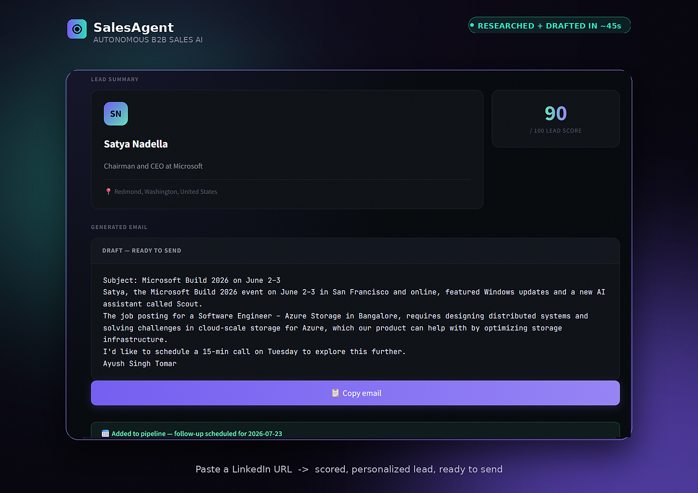

# SalesAgent — Autonomous B2B Sales AI

    

An AI agent that researches a lead, scores them, and writes a personalized cold email — in under a minute, from just a LinkedIn URL.

🔗 **[Live Demo](https://salesagent-theta.vercel.app)**  |  💻 [GitHub](https://github.com/ayush-s-tomar/salesagent)  |  👤 [LinkedIn](https://www.linkedin.com/in/ayushsinghtomar/)

> **Note:** The backend runs on Render's free tier, which spins down after inactivity. The first request after a period of idle time can take 30–60s to wake up — the UI shows live elapsed time and explains this while it happens, so it's clear the agent is working, not stuck.

**TL;DR**
- 🔍 **Real tool-calling agent** (LangGraph) — researches, scores, and drafts an email autonomously, not a hardcoded pipeline
- ✅ **Grounded, not hallucinated** — every fact in the output is checked against the source it came from before being trusted
- 🚀 **Live, working demo** — paste any public LinkedIn URL and watch it run end-to-end in the browser



**One URL in. A scored, personalized lead out.**


*Live agent trace — research → score → draft → save, end to end.*

## 🎥 Demo Video

`docs/demo.mp4`

## Why I Built This

I was spending 1–2 hours per lead doing manual research before writing a single cold email — checking LinkedIn, Googling company news, digging through job postings for pain points. It felt like exactly the kind of multi-step, tool-using task an LLM agent should own end-to-end, not just assist with. So I built one that does the whole loop: research → score → draft → save → remember.

## The Problem

Manual B2B lead research takes 1–2 hours per lead: checking LinkedIn, Googling company news, reading job postings to infer pain points, then writing a personalized email from scratch.

SalesAgent compresses this to under a minute — not a CRM with AI bolted on, but an AI agent that is the workflow.

## What It Does

Paste a LinkedIn URL. The LangGraph agent autonomously runs a 5-step pipeline:

| Step | What happens |
|---|---|
| 🔍 Research | Calls tools to search company news, analyze job postings for pain points, find tech stack |
| 📊 Score | Random Forest ML model scores the lead 0–100 based on profile & company signals |
| ✍️ Draft | Writes a hyper-personalized cold email referencing real company events & hiring signals |
| 💾 Save | Adds enriched lead + deal to CRM pipeline with auto-scheduled follow-up |
| 🧠 Remember | Stores full interaction history for future agent recall |

```
LinkedIn URL → [Research] → [Score] → [Draft Email] → [Pipeline]
                   ↑                                        |
                   └──────── Long-term memory (SQLite) ─────┘
```

The scorer is a Random Forest trained on 6 features (`has_company`, `has_title`, `skills_count`, `has_summary`, `has_news`, `has_jobs`) — weighted so active news coverage and open job postings count most (30% + 25% combined), since those best signal a company that's actively growing right now. It's trained on synthetic data with hand-set weights rather than real historical deal outcomes — a real production version would retrain this on actual won/lost CRM data. See `ml/scorer.py::train_and_save`.

## Demo Output

**Input:** `https://www.linkedin.com/in/satya-nadella`

**Agent trace (live):**

```
🔍 Researching lead from LinkedIn...           ✅ DONE  →  Found: Satya Nadella at Microsoft
📊 Scoring lead with ML model...               ✅ DONE  →  94/100
✍️ Drafting personalized cold email...         ✅ DONE
💾 Saving to CRM pipeline...                   ✅ DONE  →  Follow-up: auto-scheduled
```

**Generated email (real output):**

```
Subject: August 13, 2026 — Senior/Principal Product Systems Engineer posting

Satya, the August 13 2026 posting for a Senior/Principal Product Systems
Engineer in Cambridge cites AI, systems and networking research as core
responsibilities. Our release-planner analytics platform pulls the Microsoft
release planner tool data for Oct 2025–Mar 2026 and auto-generates
engineer-specific feature views, cutting manual build-up time by 40% in
internal tests...
```

The agent found real, live company data — an active engineering job posting, its specific responsibilities and location — and synthesized it into a fact-first, targeted email tied to a concrete hiring signal. No templates. No placeholders.

## Tech Stack

| Layer | Technology |
|---|---|
| Agent framework | LangGraph (StateGraph + tool-calling loop) |
| LLM | Groq API (`openai/gpt-oss-120b`) |
| Web intelligence | Tavily Search API |
| LinkedIn enrichment | Proxycurl API (optional) → Tavily search + LLM extraction fallback |
| ML lead scoring | scikit-learn (Random Forest) |
| Backend | FastAPI + SQLite, containerized (Docker) |
| Frontend | React + Tailwind |
| Backend deploy | Render (Docker) |
| Frontend deploy | Vercel |

## What Makes This Agentic

**Real tool-calling** — The LLM receives 4 tool schemas and decides per-step whether and how to call each one. Not a hardcoded pipeline. See `agent/llm.py::run_with_tools`.

**Multi-signal reasoning** — The agent synthesizes company news + job postings + tech stack before writing a single word. Each source informs the output differently.

**Grounded extraction** — When no paid LinkedIn API key is available, profile data is extracted from live search results by an LLM, then cross-checked against the source text before being trusted. If a field (like company name) can't be traced back to something the search actually returned, it's dropped rather than guessed — see `agent/tools.py::_search_based_profile`.

**Self-correcting email drafts** — Generated emails are validated against hard rules (no placeholders, no generic filler phrases, must open with a specific fact) before being shown. A draft that fails gets rewritten automatically. See `agent/graph.py::node_email`.

**Persistent deal memory** — Every interaction is stored in SQLite. Revisit a lead weeks later and the agent has full context: tone used, last touchpoint, company changes.

**Live SSE trace** — Every node streams a Server-Sent Event to the UI in real time, showing exactly what the agent is doing step by step, with elapsed time visible throughout.

## Project Structure

```
salesagent/
├── backend/
│   ├── main.py              # FastAPI app — REST + SSE streaming
│   ├── agent/
│   │   ├── state.py         # AgentState TypedDict schema
│   │   ├── graph.py         # LangGraph StateGraph (5 nodes)
│   │   ├── llm.py           # LLM wrapper + agentic tool-calling loop
│   │   └── tools.py         # 4 research tools + JSON schemas
│   ├── memory/
│   │   └── store.py         # SQLite (leads, deals, interactions)
│   ├── ml/
│   │   └── scorer.py        # Random Forest lead scorer
│   ├── tests/
│   │   └── test_smoke.py    # Import/build/output-range smoke tests (CI)
│   └── api/
│       ├── leads.py         # CRUD endpoints
│       ├── deals.py         # Pipeline stage management
│       └── emails.py        # Email regeneration
├── frontend/
│   └── src/
│       ├── pages/
│       │   ├── AgentPage.js     # Live agent UI + SSE trace + elapsed timer
│       │   ├── PipelinePage.js  # Kanban deal board
│       │   └── LeadsPage.js     # Lead table + detail view
│       └── components/
│           └── Sidebar.js
├── docs/
│   ├── demo-screenshot.png
│   ├── demo.gif
│   └── demo.mp4
├── .github/
│   └── workflows/
│       └── ci.yml           # Runs smoke tests on every push/PR
├── LICENSE
├── render.yaml
└── README.md
```

## Run Locally

```bash
# 1. Clone
git clone https://github.com/ayush-s-tomar/salesagent.git
cd salesagent

# 2. Backend
cd backend
py -3.11 -m venv venv
venv\Scripts\activate          # Mac/Linux: source venv/bin/activate
pip install -r requirements.txt

# 3. API keys
cp .env.example .env
# Add GROQ_API_KEY and TAVILY_API_KEY to .env

# 4. Start backend
uvicorn main:app --reload
# → http://localhost:8000/docs

# 5. Frontend (new terminal)
cd ../frontend
npm install
cp .env.example .env          # REACT_APP_API_URL=http://localhost:8000
npm start
# → http://localhost:3000
```

**Free API keys (no credit card required):**

- Groq → https://console.groq.com/keys
- Tavily → https://app.tavily.com
- Proxycurl → https://nubela.co/proxycurl (optional, $0.01/profile — fallback works without it)

## API Reference

| Method | Endpoint | Description |
|---|---|---|
| POST | `/api/agent/run` | Run agent on LinkedIn URL (SSE stream) |
| GET | `/api/health` | Health check / cold-start wake-up ping |
| GET | `/api/leads/` | List all leads |
| GET | `/api/leads/{id}` | Lead detail + interaction history |
| GET | `/api/deals/` | All deals with pipeline stages |
| PATCH | `/api/deals/{id}/stage` | Move deal to new stage |
| POST | `/api/emails/regenerate` | Regenerate email with different tone |

```bash
# Quick test (after running the backend locally — see "Run Locally" above)
curl -X POST http://localhost:8000/api/agent/run \
  -H "Content-Type: application/json" \
  -d '{"linkedin_url": "https://linkedin.com/in/satya-nadella"}'
```

## What I'd Add Next

- **Retrain the scorer on real outcomes** — swap the synthetic hand-weighted training data for actual won/lost deal history once there's enough volume, so the model learns real signal instead of my guessed weights
- **Wire up `evals/judge.py` in CI** — the LLM-as-judge scorer already exists locally; next step is running it automatically on every PR so email-quality regressions get caught before merge, not after
- Postgres migration — move off SQLite once this needs concurrent writes from more than one user
- Gmail integration — send drafted emails directly from the CRM instead of copy-paste
- Skip cold starts entirely — move the backend to a tier that stays warm, or add a scheduled keep-alive ping, once this needs to feel instant for a live audience

## Known Limitations

- **Free-tier hosting** — the backend runs on Render's free tier, which spins down after inactivity. Expect a 30–60s cold-start delay on the first request after idle time; the UI surfaces live elapsed time and an explanation during this wait rather than a silent spinner (verified in practice — a cold-start run completed in 55s with the timer counting throughout).
- **LinkedIn profile scraping is best-effort.** Without a paid Proxycurl key, the agent falls back to a Tavily search + LLM extraction. Extracted fields (name, company) are checked against the source search text before being trusted — if a field can't be grounded in what was actually found, it's left blank rather than guessed, since thin or newly-created profiles may not return enough indexed content for a confident match.
- **Free-tier LLM rate limits (Groq)** mean heavy concurrent usage may briefly slow or queue email generation.
- **SQLite for persistence** — fine for a portfolio/demo scale, but a production version would move to Postgres for concurrent writes and durability.
- **No authentication layer** — this is a single-user demo; a real CRM deployment would need proper multi-tenant auth before handling real prospect data. (CORS is currently open to any origin to support this — see `backend/main.py`.)

## 🤝 Contributing

Contributions, issues, and feature requests are welcome! Feel free to check the [issues page](https://github.com/ayush-s-tomar/salesagent/issues).

1. Fork the project
2. Create your feature branch (`git checkout -b feature/amazing-feature`)
3. Commit your changes (`git commit -m 'Add some amazing feature'`)
4. Push to the branch (`git push origin feature/amazing-feature`)
5. Open a Pull Request

## 📄 License

Distributed under the MIT License. See `LICENSE` for more information.

## 🙋 Author

**Ayush Singh Tomar** — [GitHub](https://github.com/ayush-s-tomar)

Part of my AI developer portfolio — agents that do real, autonomous work, not chatbots with a prompt. See also: AgentLoop, a multi-step research agent with tool-use and long-term memory.
