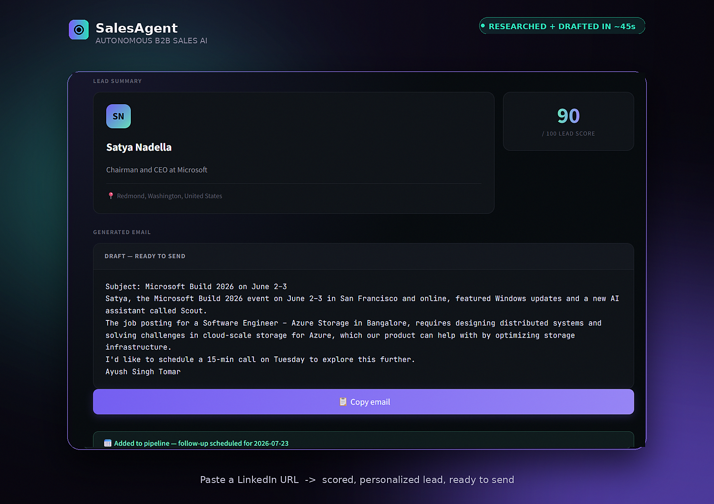

# SalesAgent — Autonomous B2B Sales Agent

     

An AI agent that takes a LinkedIn URL, researches the lead and their company, scores the lead, and drafts a personalized cold email in about a minute.

**[Live Demo](https://salesagent-theta.vercel.app)** · [GitHub](https://github.com/ayush-s-tomar/salesagent) · [LinkedIn](https://www.linkedin.com/in/ayushsinghtomar/)

> **Note:** the backend runs on Render's free tier, which spins down when idle. The first request after a quiet period can take 30–60s to wake up. The UI shows live elapsed time and explains the wait.

**TL;DR**
- **Tool-calling agent (LangGraph).** The LLM decides which research tools to call; the pipeline around it is a fixed four-step graph.
- **Guardrails on the output.** Drafts are checked for placeholders, filler phrases, length and invented dates, and get one automatic rewrite if they fail.
- **Fails visibly.** Empty model output is retried, then replaced by a plain fallback template; missing research data no longer crashes the run.
- **Live demo.** Paste a public LinkedIn URL and watch each step stream into the browser.

**Jump to:** [What it does](#what-it-does) · [What makes this agentic](#what-makes-this-agentic) · [Reliability](#reliability-notes) · [Tech stack](#tech-stack) · [Run locally](#run-locally) · [Known limitations](#known-limitations) · [Roadmap](#roadmap)


<details>
<summary><b>Screenshot and full video walkthrough</b></summary>
<br/>



<br/>

https://github.com/user-attachments/assets/a5b6394c-325b-4049-8a22-a891fb489f08

</details>

---

## Why I Built This

Manual B2B lead research is slow: check LinkedIn, search for company news, read job postings to infer priorities, then write an email from scratch. It is a multi-step, tool-using task that suits an LLM agent, so I built one that runs the whole loop: research, score, draft, save.

## What It Does

Paste a LinkedIn URL. A LangGraph workflow runs four steps and streams progress to the UI:

| Step | What happens |
|---|---|
| Research | The LLM calls tools to scrape the profile, search company news, analyze job postings and find the tech stack |
| Score | A Random Forest model scores the lead 0–100 from profile and company signals |
| Draft | Writes a cold email anchored on one real signal (news, then hiring, then tech stack) |
| Save | Stores the lead, deal and email in the CRM pipeline, with an interaction log and a follow-up date 3 days out |

```
LinkedIn URL -> [Research] -> [Score] -> [Draft Email] -> [Save to Pipeline]
                                                              |
                                      SQLite: leads, deals, interaction history
```

**Scoring.** The scorer is a Random Forest on six features (`has_company`, `has_title`, `skills_count`, `has_summary`, `has_news`, `has_jobs`), weighted so recent news and open job postings count most. It is trained on synthetic data with hand-set weights, not real deal outcomes, so scores are a directional signal only. See `ml/scorer.py::train_and_save`.

## What Makes This Agentic

**Tool calling.** The LLM receives four tool schemas and decides per step whether and how to call each one. See `agent/llm.py::run_with_tools`.

**One signal per email.** Instead of stitching together unrelated facts, the drafter picks a single primary signal (news, then hiring, then tech stack) and builds the whole email around it. See `agent/graph.py::_pick_primary_signal`.

**Grounded profile extraction.** Without a paid LinkedIn API key, profile data is extracted from live search results by an LLM and checked against the source text. A field that cannot be traced back to what the search returned (such as a company name) is dropped rather than guessed. See `agent/tools.py::_search_based_profile`.

**Self-correcting drafts.** Each draft is validated against hard rules: no placeholders, no generic filler phrases, a word limit, and no month-and-day dates that are absent from the research text. A failing draft is rewritten once with the violations listed. See `agent/graph.py::node_email`.

**Persistent memory.** Leads, deals and interactions are stored in SQLite so a lead can be revisited with its history.

**Live SSE trace.** Every node streams a Server-Sent Event to the UI, so the user sees what the agent is doing as it runs.

## Reliability Notes

Problems found while testing, and how they are handled:

- **Blank emails from a reasoning model.** The model (`gpt-oss-120b`) spends part of its token budget on hidden reasoning. With a small `max_tokens`, it could use all of it and return an empty email with no error. Fix: reasoning effort set to low, a larger token budget, up to three retries on empty output, and a short fallback template if the model still returns nothing (the trace labels it "fallback template").
- **Invented specifics.** An early draft cited a dated policy that appeared nowhere in the research. The validator now flags any month-and-day date in the email that is not in the source text and triggers the rewrite pass.
- **Missing research data.** Profiles with no news, jobs or tech results used to crash the run on a `None` value. These are now treated as empty and the email falls back to the best available signal.
- **Rate limits.** Groq per-minute (TPM) limits are retried using the wait time Groq reports. Daily-quota (TPD) errors fail fast with a clear message instead of tying up the single Render worker.

## Tech Stack

| Layer | Technology |
|---|---|
| Agent framework | LangGraph (StateGraph with a tool-calling loop) |
| LLM | Groq API (`openai/gpt-oss-120b`) |
| Web intelligence | Tavily Search API |
| LinkedIn enrichment | Proxycurl API (optional), falling back to Tavily search plus LLM extraction |
| ML lead scoring | scikit-learn (Random Forest) |
| Backend | FastAPI, SQLite, Docker |
| Frontend | React, Tailwind |
| Deploy | Render (backend, Docker), Vercel (frontend) |

## Project Structure

```
salesagent/
├── backend/
│   ├── main.py              # FastAPI app: REST + SSE streaming
│   ├── agent/
│   │   ├── state.py         # AgentState TypedDict schema
│   │   ├── graph.py         # LangGraph StateGraph (4 nodes) + email validation
│   │   ├── llm.py           # LLM wrapper, tool-calling loop, rate-limit handling
│   │   └── tools.py         # 4 research tools + JSON schemas
│   ├── memory/
│   │   └── store.py         # SQLite (leads, deals, interactions)
│   ├── ml/
│   │   └── scorer.py        # Random Forest lead scorer
│   ├── tests/
│   │   └── test_smoke.py    # Import/build/output-range smoke tests (CI)
│   └── api/
│       ├── leads.py         # CRUD endpoints
│       ├── deals.py         # Pipeline stage management
│       └── emails.py        # Email regeneration
├── frontend/
│   └── src/
│       ├── pages/
│       │   ├── AgentPage.js     # Live agent UI, SSE trace, elapsed timer
│       │   ├── PipelinePage.js  # Kanban deal board
│       │   └── LeadsPage.js     # Lead table and detail view
│       └── components/
│           └── Sidebar.js
├── docs/                    # Demo GIF, screenshot, video
├── .github/workflows/ci.yml # Smoke tests on every push/PR
├── render.yaml
├── LICENSE
└── README.md
```

## Run Locally

```bash
# 1. Clone
git clone https://github.com/ayush-s-tomar/salesagent.git
cd salesagent

# 2. Backend
cd backend
py -3.11 -m venv venv
venv\Scripts\activate          # Mac/Linux: source venv/bin/activate
pip install -r requirements.txt

# 3. API keys
cp .env.example .env
# Add GROQ_API_KEY and TAVILY_API_KEY (optionally SENDER_NAME) to .env

# 4. Start backend
uvicorn main:app --reload
# -> http://localhost:8000/docs

# 5. Frontend (new terminal)
cd ../frontend
npm install
cp .env.example .env          # REACT_APP_API_URL=http://localhost:8000
npm start
# -> http://localhost:3000
```

**Free API keys (no credit card required):**
- Groq: https://console.groq.com/keys
- Tavily: https://app.tavily.com
- Proxycurl (optional, about $0.01 per profile; the fallback works without it): https://nubela.co/proxycurl

## API Reference

| Method | Endpoint | Description |
|---|---|---|
| POST | `/api/agent/run` | Run the agent on a LinkedIn URL (SSE stream) |
| GET | `/api/health` | Health check and cold-start wake-up ping |
| GET | `/api/leads/` | List all leads |
| GET | `/api/leads/{id}` | Lead detail and interaction history |
| GET | `/api/deals/` | All deals with pipeline stages |
| PATCH | `/api/deals/{id}/stage` | Move a deal to a new stage |
| POST | `/api/emails/regenerate` | Regenerate an email with a different tone |

```bash
# Quick test (backend running locally)
curl -X POST http://localhost:8000/api/agent/run \
  -H "Content-Type: application/json" \
  -d '{"linkedin_url": "https://www.linkedin.com/in/your-profile"}'
```

## Known Limitations

- **Free-tier hosting.** Expect a 30–60s cold start after idle time; the UI shows elapsed time during the wait.
- **Profile scraping is best-effort.** Without a paid Proxycurl key, the agent falls back to search plus LLM extraction. Thin or new profiles may return little, and unverifiable fields are left blank.
- **Email checks are heuristic.** The validator catches banned phrases, length, placeholders and invented month-and-day dates. It cannot verify other kinds of claims (numbers, product names, policies), so review drafts before sending.
- **Fallback emails are generic.** When the model returns nothing or research data is missing, the draft is a short template built from whatever real text exists.
- **Synthetic scorer.** Lead scores come from a model trained on synthetic data and are not validated against deal outcomes.
- **Groq rate limits.** Heavy concurrent use can slow or queue email generation, and the free daily quota can run out.
- **SQLite and no auth.** Fine at demo scale. A production version would use Postgres and multi-tenant authentication. CORS is currently open to any origin (see `backend/main.py`).

## Roadmap

- [ ] Retrain the scorer on real won/lost deal outcomes instead of hand-set synthetic weights
- [ ] Run the LLM-as-judge in `evals/judge.py` in CI so email-quality regressions are caught before merge
- [ ] Extend the grounding check beyond dates to numbers and named entities
- [ ] Migrate from SQLite to Postgres for concurrent writes
- [ ] Send drafted emails directly through Gmail
- [ ] Add a keep-alive ping or an always-on tier to remove cold starts

## Contributing

Issues and feature requests are welcome on the [issues page](https://github.com/ayush-s-tomar/salesagent/issues).

1. Fork the project
2. Create your feature branch (`git checkout -b feature/amazing-feature`)
3. Commit your changes (`git commit -m 'Add some amazing feature'`)
4. Push to the branch (`git push origin feature/amazing-feature`)
5. Open a Pull Request

## License

Distributed under the MIT License. See `LICENSE` for more information.

## Author

**Ayush Singh Tomar** — [GitHub](https://github.com/ayush-s-tomar) · [LinkedIn](https://www.linkedin.com/in/ayushsinghtomar) · [Portfolio](https://ayush-s-tomar.vercel.app)

*Part of my AI developer portfolio. See also: [AgentLoop](https://github.com/ayush-s-tomar/agentloop), a multi-step research agent with tool use and long-term memory.*
